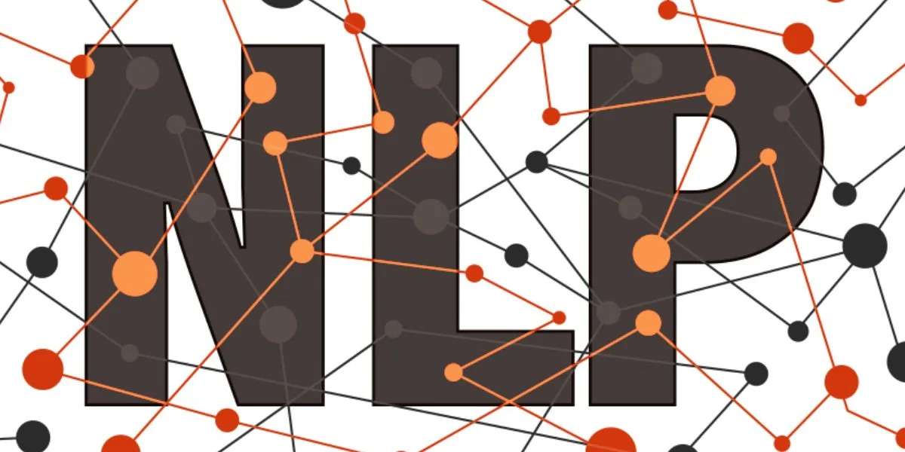

## About Me

My name is Joseph Min. This is my personal website and showcases some of my recent projects.

<!-- Upload your own photo and change the path -->

  

---

## Portfolio

<!-- You can link to other websites, PDFs in this repo, and other pages in this repo -->

_**[Natural language processing 10-Ks to identify risks](10k_nlp_covid)**_

You can show off your midterm analysis by moving the report components and output into this file. Or...

---

_**[Regression Practice](Regression_practice)**_

Or: The process that created this page can be used to show off your whole midterm analysis file, as is.

---

_**[Assignment 1](asgn01exercises)**_

---

_**[Midterm Project](midterm/analysis_report.md)**_

---

_**[Some personal project](/pdf/sample_presentation.pdf)**_

---

## Career Objectives

This spring, I will be graduating with a B.S. in Integrated Business and Engineering with a concentration in Finance. I will being staying a 5th year at Lehigh to finish up my B.S. in Industrial and Systems Engineering (w/ Computer Science minor). 

After graduation, I will be moving to New York City to work at KPMG as an associate within their Financial Services Solutions group. I hope to gain a diverse set of experiences through meeting new clients and working on various engagements. 
---

## Hobbies

I enjoy watching Philadelphia sports teams, hanging out with friends, hiking, taking hour long naps, running, and eating food. 

---

Page template forked from <a href="https://github.com/evanca/quick-portfolio">evanca</a>

<!-- Remove above link if you don't want to attibute -->
