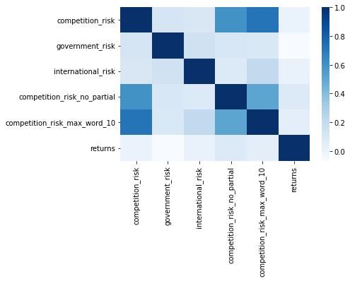
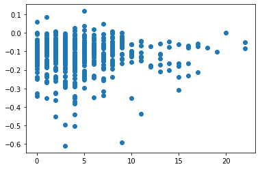

---
layout: wide_default
---    


# Analysis Report
The purpose of this report is to analyze S&P500 firms and how they were hurt more or less by Covid-19. More specifically, various risk factors were analyzed using Natural Language Processing (NLP) to find the association between the risk and the better/worse stock returns around the onset of the pandemic.

## Final Output Sample:


```python
import pandas as pd
sp500 = pd.read_csv('output/sp500_accting_plus_textrisks.csv')
sp500.head()
```


<div>
<style scoped>
    .dataframe tbody tr th:only-of-type {
        vertical-align: middle;
    }

    .dataframe tbody tr th {
        vertical-align: top;
    }

    .dataframe thead th {
        text-align: right;
    }
</style>
<table border="1" class="dataframe">
  <thead>
    <tr style="text-align: right;">
      <th></th>
      <th>Unnamed: 0</th>
      <th>Unnamed: 0.1</th>
      <th>Unnamed: 0.1.1</th>
      <th>Unnamed: 0.1.1.1</th>
      <th>Symbol</th>
      <th>Security</th>
      <th>SEC filings</th>
      <th>GICS Sector</th>
      <th>GICS Sub-Industry</th>
      <th>Headquarters Location</th>
      <th>...</th>
      <th>prof_a</th>
      <th>ppe_a</th>
      <th>cash_a</th>
      <th>xrd_a</th>
      <th>dltt_a</th>
      <th>invopps_FG09</th>
      <th>sales_g</th>
      <th>dv_a</th>
      <th>short_debt</th>
      <th>returns</th>
    </tr>
  </thead>
  <tbody>
    <tr>
      <th>0</th>
      <td>0</td>
      <td>0</td>
      <td>0</td>
      <td>0</td>
      <td>MMM</td>
      <td>3M</td>
      <td>reports</td>
      <td>Industrials</td>
      <td>Industrial Conglomerates</td>
      <td>Saint Paul, Minnesota</td>
      <td>...</td>
      <td>0.193936</td>
      <td>0.228196</td>
      <td>0.065407</td>
      <td>0.042791</td>
      <td>0.408339</td>
      <td>2.749554</td>
      <td>NaN</td>
      <td>0.074252</td>
      <td>0.143810</td>
      <td>-0.077905</td>
    </tr>
    <tr>
      <th>1</th>
      <td>1</td>
      <td>1</td>
      <td>1</td>
      <td>1</td>
      <td>AOS</td>
      <td>A. O. Smith</td>
      <td>reports</td>
      <td>Industrials</td>
      <td>Building Products</td>
      <td>Milwaukee, Wisconsin</td>
      <td>...</td>
      <td>0.177698</td>
      <td>0.193689</td>
      <td>0.180314</td>
      <td>0.028744</td>
      <td>0.103303</td>
      <td>NaN</td>
      <td>NaN</td>
      <td>0.048790</td>
      <td>0.056170</td>
      <td>-0.028109</td>
    </tr>
    <tr>
      <th>2</th>
      <td>2</td>
      <td>2</td>
      <td>2</td>
      <td>2</td>
      <td>ABT</td>
      <td>Abbott</td>
      <td>reports</td>
      <td>Health Care</td>
      <td>Health Care Equipment</td>
      <td>North Chicago, Illinois</td>
      <td>...</td>
      <td>0.118653</td>
      <td>0.132161</td>
      <td>0.060984</td>
      <td>0.035942</td>
      <td>0.256544</td>
      <td>2.520681</td>
      <td>NaN</td>
      <td>0.033438</td>
      <td>0.088120</td>
      <td>-0.001101</td>
    </tr>
    <tr>
      <th>3</th>
      <td>3</td>
      <td>3</td>
      <td>3</td>
      <td>3</td>
      <td>ABBV</td>
      <td>AbbVie</td>
      <td>reports</td>
      <td>Health Care</td>
      <td>Pharmaceuticals</td>
      <td>North Chicago, Illinois</td>
      <td>...</td>
      <td>0.178107</td>
      <td>0.037098</td>
      <td>0.448005</td>
      <td>0.076216</td>
      <td>0.709488</td>
      <td>2.211589</td>
      <td>NaN</td>
      <td>0.071436</td>
      <td>0.057566</td>
      <td>-0.038844</td>
    </tr>
    <tr>
      <th>4</th>
      <td>4</td>
      <td>4</td>
      <td>4</td>
      <td>4</td>
      <td>ABMD</td>
      <td>Abiomed</td>
      <td>reports</td>
      <td>Health Care</td>
      <td>Health Care Equipment</td>
      <td>Danvers, Massachusetts</td>
      <td>...</td>
      <td>0.225749</td>
      <td>0.137531</td>
      <td>0.466354</td>
      <td>0.088683</td>
      <td>0.000000</td>
      <td>12.164233</td>
      <td>NaN</td>
      <td>0.000000</td>
      <td>NaN</td>
      <td>-0.090781</td>
    </tr>
  </tbody>
</table>
<p>5 rows × 64 columns</p>
</div>


## Risk measurements
The following are the risks that were measured:

### 1. Competition in the Market
--------
**Measurement Method:** The NEAR_regex function was applied with three different parameters when measuring risks associated to competition within the market. 

First, words such as *high, significant, increase,* and *pressure* that were near *competition* were measured. The default max_words_between and cases_matter were used, but partial was set as True in order to see if similar words such as 'highly' or 'increased' were near competition as well. 

Thereafter, more words were added to the NEAR_regex method. Words such as *high, significant, increase, substantial, great,* and *large* were compared to *competition*. Additionally, the max_words_between was increased from 5 to 10 words, but partial was set to False.

Finally, the last modification for the risk was decreasing the number of words to compare as well as setting partial as True in order to see various words similar to competition, such as competitor or competitors. The words to compare were *high, significant,* and *increase*. In order to use similar words to competition, the word used for NEAR_regex was reduced to 'compet'

Below is a code example of the last modification that was placed within the for loop for all 500 firms:

```python
 sp500_df.at[index, 'competition_risk_max_word_10'] = len(re.findall(NEAR_regex(list_of_words = ['compet', '(high|significant|increase)'],max_words_between = 10,cases_matter = False, partial = True),text))

```

**Economic Reasoning:** The competition within the market was of interest as increased competition oftentimes significantly affects the stock prices of the firms within the same or similar industry. The more competitors there are within the same industry, the less market share that the firm will most likely have as other firms take a greater share in the market. Additionally, as more competitors enter into the industry, the pricing of products/services may change as there is a greater supply but similar demands. Thus, the firm's profit levels may also go down, which may affect the overall stock price as well.

**Statistical Properties:** There are 492 values that were examined to using NEAR_regex and the mean hits were 2.569106, while the standard deviation was 2.304980. The minimum number of hits was 0, while the maximum number of hits was 13. 1 hit was most frequent with 101 firms, followed by 0 hits for 92 firms, and 2 hits with 87 firms. The following code can be run to quickly get the basic features of the 'competition_risk' column within the dataset:
```python
print(sp500['competition_risk'].describe())
print(sp500['competition_risk'].value_counts())
```

### 2. Government/Legal Regulations
--------
**Measurement Method:** For government/legal regulatory risks, words such as *legal, government*, and *policy* were compared to *fail, liability, cost,* and *harm*. partial was set as True, thus in the regex, fail can also look for words such as failure, fails, and failures.

**Economic Reasoning:** More failures and costs that are associated with government/legal policies may indicate more risks. As the amount of government intervention or policies increase, there may be greater costs associated with running the firm. If a firm fails to comply to government regulations or policies, they could incur  cost from the federal/state government. Additionally, the amount of government intervention on a firm may cause negative reactions from customers that are interested in the private market. All these factors may affect the stock prices significantly. 

**Statistical Properties:**
There are 492 values that were examined to using NEAR_regex and the mean hits were 6.662602, while the standard deviation was 10.771085. As compared to the previous risk, there are much wider ranging values in terms of hits with the NEAR_regex. The minimum number of hits was 0, while the maximum number of hits was 101. It is interesting to point out that there were also higher hits including 31 hits 3 times and 44 hits 1 time. 4 hits were most frequent with 72 firms, followed by 3 hits for 63 firms, and 2 hits with 58 firms. The following code can be run to quickly get the basic features of the 'competition_risk' column within the dataset:

```python
print(sp500['government_risk'].describe())
print(sp500['government_risk'].value_counts())
```

### 3. Global and International Violatility/Risks
--------
**Measurement Method:** For international risks, words such as *global* and *international* were compared to *competition, change, fluctuation, affect,* and *volatile*. partial was set as True and certain words were shorten to 'compet', 'fluctua', and 'volati' so that similar words such as volatile and volatility can be measured.

**Economic Reasoning:** The volatility of the international market can have an overall impact on a firm's stock price as most of these S&P500 have a global presence and are not only confined to the US market. Thus, when the volatility of the international market increases and there are lots of fluctuation and changes in the market place, this may disrupt the firm's overall business and may impact firm's performance overall. Additionally, international regulations or tariffs may affect businesses internationally for a firm which also affects stock prices.

**Statistical Properties:** There are 492 values that were examined to using NEAR_regex and the mean hits were 4.670732, while the standard deviation was 3.998131. The minimum number of hits was 0, while the maximum number of hits was 22. 2 hits was most frequent with 65 firms, followed by 3 hits for 57 firms, and 1 hits with 57 firms. The distribution of hits is skewed right. The following code can be run to quickly get the basic features of the 'competition_risk' column within the dataset:

```python
print(sp500['international_risk'].describe())
print(sp500['international_risk'].value_counts())
```

## Validataion Checks


```python
sp500[['Symbol',
       'competition_risk', 
       'government_risk', 
       'international_risk',
       'competition_risk_no_partial', 
       'competition_risk_max_word_10']].head(10)
```


<div>
<style scoped>
    .dataframe tbody tr th:only-of-type {
        vertical-align: middle;
    }

    .dataframe tbody tr th {
        vertical-align: top;
    }

    .dataframe thead th {
        text-align: right;
    }
</style>
<table border="1" class="dataframe">
  <thead>
    <tr style="text-align: right;">
      <th></th>
      <th>Symbol</th>
      <th>competition_risk</th>
      <th>government_risk</th>
      <th>international_risk</th>
      <th>competition_risk_no_partial</th>
      <th>competition_risk_max_word_10</th>
    </tr>
  </thead>
  <tbody>
    <tr>
      <th>0</th>
      <td>MMM</td>
      <td>0.0</td>
      <td>14.0</td>
      <td>3.0</td>
      <td>0.0</td>
      <td>0.0</td>
    </tr>
    <tr>
      <th>1</th>
      <td>AOS</td>
      <td>1.0</td>
      <td>0.0</td>
      <td>4.0</td>
      <td>0.0</td>
      <td>5.0</td>
    </tr>
    <tr>
      <th>2</th>
      <td>ABT</td>
      <td>1.0</td>
      <td>4.0</td>
      <td>3.0</td>
      <td>1.0</td>
      <td>4.0</td>
    </tr>
    <tr>
      <th>3</th>
      <td>ABBV</td>
      <td>3.0</td>
      <td>8.0</td>
      <td>3.0</td>
      <td>2.0</td>
      <td>6.0</td>
    </tr>
    <tr>
      <th>4</th>
      <td>ABMD</td>
      <td>0.0</td>
      <td>7.0</td>
      <td>1.0</td>
      <td>0.0</td>
      <td>0.0</td>
    </tr>
    <tr>
      <th>5</th>
      <td>ACN</td>
      <td>1.0</td>
      <td>11.0</td>
      <td>6.0</td>
      <td>0.0</td>
      <td>5.0</td>
    </tr>
    <tr>
      <th>6</th>
      <td>ATVI</td>
      <td>7.0</td>
      <td>5.0</td>
      <td>1.0</td>
      <td>2.0</td>
      <td>15.0</td>
    </tr>
    <tr>
      <th>7</th>
      <td>ADM</td>
      <td>3.0</td>
      <td>1.0</td>
      <td>18.0</td>
      <td>4.0</td>
      <td>6.0</td>
    </tr>
    <tr>
      <th>8</th>
      <td>ADBE</td>
      <td>3.0</td>
      <td>5.0</td>
      <td>8.0</td>
      <td>5.0</td>
      <td>12.0</td>
    </tr>
    <tr>
      <th>9</th>
      <td>ADP</td>
      <td>0.0</td>
      <td>3.0</td>
      <td>2.0</td>
      <td>0.0</td>
      <td>3.0</td>
    </tr>
  </tbody>
</table>
</div>


In order to check the validity of the number of hits that the NEAR_regex model found using the specified parameter for each risk, several 10-K reports were searched manually to see if the list of words inputted were logical and would effectively capture the firm's risk associated with these words. As seen above, A O Smith Corp (ticker symbol: AOS) had 4 hits in regards to international risks. As aforementioned, for international risks, words such as global and international were compared to competition, change, fluctuation, affect, and volatile. partial was set as True and certain words were shorten to 'compet', 'fluctua', and 'volati' so that similar words such as volatile and volatility can be measured. Below are some examples of where in the 10-K these hits occurred:

- "Any of these disruptions or other extraordinary events outside of our control that impact our operations or the operations of our suppliers and key distributors could affect our business negatively, harming operating results. In addition, these types of events also could negatively impact consumer spending in the impacted regions or depending on the severity, **globally**, which could materially and adversely **affect** our financial condition, results of operations and cash flows."

- "We are subject to risks associated with operating in foreign countries including fluctuations in currency exchange rates and interest rates, hyperinflation in some foreign countries or **global** exchange rate instability or **volatility** that strengthens the U.S. dollar against foreign currencies. As a result, an increase in the value of the U.S. dollar relative to the local currencies of our foreign markets has had and would continue to have a negative effect on our profitability."

In both cases, these hits were within the "Risk Factor" section of the 10-K reports which may suggest that these set of words are in fact valid hits, and the more hits there are, the greater international risks associated with that particular firm. However, when checking the same risk with another firm, there is some evidence that may suggest this this regex may not be as effective in capturing the true risk measurement. For example, for ABIOMED, Inc. (ticker ABMD), there is a large portion of the Risk Factors sections dedicated towards discussing the economic risks associated with international/global risks. In fact 
the words international and global occur nearly 50 times in the page, most of which are within the risk factors section, but the regex only was able to capture one occurrence. 


In regards to risks associated with competition, words such as high, significant, increase, and pressure that were near competition were measured. Activision Blizzard (ATVI) had 7 hits using the first method of competition risk measurement, but nearly double (15) the number of hits when the NEAR_regex max_words_between was changed to 10 and the term 'competition' was changed to 'compet' in order to use partial words. Below is an example of why there was such a huge difference in hits occurred. This chunk of text was within the Risk Factors section when discussing about the competitive nature of the interactive entertainment industry: 

- **Competition** within, and to, the interactive entertainment industry is intense, and competitors may succeed in reducing our sales.

- We *compete* with other publishers of interactive entertainment software, both within and outside the United States. Our *competitors* include very large corporations with significantly greater financial, marketing and product development resources than we have. Our larger *competitors* may be able to leverage their greater financial, technical, personnel and other resources to provide larger budgets for development and marketing and make higher offers to licensors and developers for commercially desirable properties, as well as adopt more aggressive pricing policies to develop more commercially successful video game products than we do. In addition, *competitors* with large portfolios and popular games typically have greater influence with platform providers, retailers, distributors and other customers who may, in turn, provide more favorable support to those *competitors’* games.
- Additionally, we *compete* with other forms of entertainment and leisure activities. As our business continues to expand in complexity and scope, we have increased exposure to additional *competitors*, including those with access to large existing user bases and control over distribution channels. Further, it is difficult to predict and prepare for rapid changes in consumer demand that could materially alter public preferences for different forms of entertainment and leisure activities. Failure to adequately identify and adapt to these *competitive* pressures could negatively impact our business.

The word competition was **bolded** and words similar to competition such as compete, competitors, and competitive have been *italicized*. Just in this small section alone, there are 8 times the number of italicized words compared to the single bolded word. Despite talking about the same risk factor in the same section, the two different NEAR_regex parameters used to find hits significantly changed and the number of hits increased nearly twofold throughout this document due to this change. This may suggest that the parameter changes made to the original competition risk measurement method may not be as effective in displaying the true risks associated with the firm's competition in the market as the number of hits may be inflated when partial and the number of words in between are too lenient.

## Final Sample Analysis

Below are some Exploratory Data Analysis of the final dataframe analyzed:


```python
sp500[['competition_risk', 'government_risk', 'international_risk','competition_risk_no_partial', 'competition_risk_max_word_10', 'returns']].info()
```

    <class 'pandas.core.frame.DataFrame'>
    RangeIndex: 505 entries, 0 to 504
    Data columns (total 6 columns):
     #   Column                        Non-Null Count  Dtype  
    ---  ------                        --------------  -----  
     0   competition_risk              492 non-null    float64
     1   government_risk               492 non-null    float64
     2   international_risk            492 non-null    float64
     3   competition_risk_no_partial   505 non-null    float64
     4   competition_risk_max_word_10  505 non-null    float64
     5   returns                       505 non-null    float64
    dtypes: float64(6)
    memory usage: 23.8 KB


```python
(
    ( # these lines do the calculation - what % of missing values are there for each var
        sp500.isna()      # ccm.isna() TURNS every obs/variable = 1 when its missing and 0 else
       .sum(axis=0)     # count the number of na for each variable (now data is 1 obs per column = # missing)
        /len(sp500)       # convert # missing to % missing 
        *100            # report as percentage
    ) 
    # you can stop here and report this...
    # but I wanted to format it a bit...
    .sort_values(ascending=False)[:10]
    .to_frame(name='% missing') # the next line only works on a frame, and because pandas sees only 1 variable at this pt
    .style.format("{:.1f}")     # in the code, it calls this a "series" type object, so convert it to dataframe type object
)
#
```


<style type="text/css">
</style>
<table id="T_300f1_">
  <thead>
    <tr>
      <th class="blank level0" >&nbsp;</th>
      <th class="col_heading level0 col0" >% missing</th>
    </tr>
  </thead>
  <tbody>
    <tr>
      <th id="T_300f1_level0_row0" class="row_heading level0 row0" >sales_g</th>
      <td id="T_300f1_row0_col0" class="data row0 col0" >100.0</td>
    </tr>
    <tr>
      <th id="T_300f1_level0_row1" class="row_heading level0 row1" >smalltaxlosscarry</th>
      <td id="T_300f1_row1_col0" class="data row1 col0" >45.3</td>
    </tr>
    <tr>
      <th id="T_300f1_level0_row2" class="row_heading level0 row2" >largetaxlosscarry</th>
      <td id="T_300f1_row2_col0" class="data row2 col0" >45.3</td>
    </tr>
    <tr>
      <th id="T_300f1_level0_row3" class="row_heading level0 row3" >invopps_FG09</th>
      <td id="T_300f1_row3_col0" class="data row3 col0" >33.9</td>
    </tr>
    <tr>
      <th id="T_300f1_level0_row4" class="row_heading level0 row4" >short_debt</th>
      <td id="T_300f1_row4_col0" class="data row4 col0" >30.9</td>
    </tr>
    <tr>
      <th id="T_300f1_level0_row5" class="row_heading level0 row5" >age</th>
      <td id="T_300f1_row5_col0" class="data row5 col0" >29.7</td>
    </tr>
    <tr>
      <th id="T_300f1_level0_row6" class="row_heading level0 row6" >tic</th>
      <td id="T_300f1_row6_col0" class="data row6 col0" >29.7</td>
    </tr>
    <tr>
      <th id="T_300f1_level0_row7" class="row_heading level0 row7" >sic</th>
      <td id="T_300f1_row7_col0" class="data row7 col0" >29.7</td>
    </tr>
    <tr>
      <th id="T_300f1_level0_row8" class="row_heading level0 row8" >sic3</th>
      <td id="T_300f1_row8_col0" class="data row8 col0" >29.7</td>
    </tr>
    <tr>
      <th id="T_300f1_level0_row9" class="row_heading level0 row9" >td</th>
      <td id="T_300f1_row9_col0" class="data row9 col0" >29.7</td>
    </tr>
  </tbody>
</table>


```python
sp500[['competition_risk', 'government_risk', 'international_risk','competition_risk_no_partial', 'competition_risk_max_word_10', 'returns']].describe(percentiles=[.01,.05,.95,.99]).T.style.format('{:,.2f}')
```


<style type="text/css">
</style>
<table id="T_4f5ec_">
  <thead>
    <tr>
      <th class="blank level0" >&nbsp;</th>
      <th class="col_heading level0 col0" >count</th>
      <th class="col_heading level0 col1" >mean</th>
      <th class="col_heading level0 col2" >std</th>
      <th class="col_heading level0 col3" >min</th>
      <th class="col_heading level0 col4" >1%</th>
      <th class="col_heading level0 col5" >5%</th>
      <th class="col_heading level0 col6" >50%</th>
      <th class="col_heading level0 col7" >95%</th>
      <th class="col_heading level0 col8" >99%</th>
      <th class="col_heading level0 col9" >max</th>
    </tr>
  </thead>
  <tbody>
    <tr>
      <th id="T_4f5ec_level0_row0" class="row_heading level0 row0" >competition_risk</th>
      <td id="T_4f5ec_row0_col0" class="data row0 col0" >492.00</td>
      <td id="T_4f5ec_row0_col1" class="data row0 col1" >2.57</td>
      <td id="T_4f5ec_row0_col2" class="data row0 col2" >2.30</td>
      <td id="T_4f5ec_row0_col3" class="data row0 col3" >0.00</td>
      <td id="T_4f5ec_row0_col4" class="data row0 col4" >0.00</td>
      <td id="T_4f5ec_row0_col5" class="data row0 col5" >0.00</td>
      <td id="T_4f5ec_row0_col6" class="data row0 col6" >2.00</td>
      <td id="T_4f5ec_row0_col7" class="data row0 col7" >7.00</td>
      <td id="T_4f5ec_row0_col8" class="data row0 col8" >10.00</td>
      <td id="T_4f5ec_row0_col9" class="data row0 col9" >13.00</td>
    </tr>
    <tr>
      <th id="T_4f5ec_level0_row1" class="row_heading level0 row1" >government_risk</th>
      <td id="T_4f5ec_row1_col0" class="data row1 col0" >492.00</td>
      <td id="T_4f5ec_row1_col1" class="data row1 col1" >6.66</td>
      <td id="T_4f5ec_row1_col2" class="data row1 col2" >10.77</td>
      <td id="T_4f5ec_row1_col3" class="data row1 col3" >0.00</td>
      <td id="T_4f5ec_row1_col4" class="data row1 col4" >0.00</td>
      <td id="T_4f5ec_row1_col5" class="data row1 col5" >0.00</td>
      <td id="T_4f5ec_row1_col6" class="data row1 col6" >4.00</td>
      <td id="T_4f5ec_row1_col7" class="data row1 col7" >17.45</td>
      <td id="T_4f5ec_row1_col8" class="data row1 col8" >46.25</td>
      <td id="T_4f5ec_row1_col9" class="data row1 col9" >110.00</td>
    </tr>
    <tr>
      <th id="T_4f5ec_level0_row2" class="row_heading level0 row2" >international_risk</th>
      <td id="T_4f5ec_row2_col0" class="data row2 col0" >492.00</td>
      <td id="T_4f5ec_row2_col1" class="data row2 col1" >4.67</td>
      <td id="T_4f5ec_row2_col2" class="data row2 col2" >4.00</td>
      <td id="T_4f5ec_row2_col3" class="data row2 col3" >0.00</td>
      <td id="T_4f5ec_row2_col4" class="data row2 col4" >0.00</td>
      <td id="T_4f5ec_row2_col5" class="data row2 col5" >0.00</td>
      <td id="T_4f5ec_row2_col6" class="data row2 col6" >4.00</td>
      <td id="T_4f5ec_row2_col7" class="data row2 col7" >13.00</td>
      <td id="T_4f5ec_row2_col8" class="data row2 col8" >17.09</td>
      <td id="T_4f5ec_row2_col9" class="data row2 col9" >22.00</td>
    </tr>
    <tr>
      <th id="T_4f5ec_level0_row3" class="row_heading level0 row3" >competition_risk_no_partial</th>
      <td id="T_4f5ec_row3_col0" class="data row3 col0" >505.00</td>
      <td id="T_4f5ec_row3_col1" class="data row3 col1" >1.62</td>
      <td id="T_4f5ec_row3_col2" class="data row3 col2" >1.72</td>
      <td id="T_4f5ec_row3_col3" class="data row3 col3" >0.00</td>
      <td id="T_4f5ec_row3_col4" class="data row3 col4" >0.00</td>
      <td id="T_4f5ec_row3_col5" class="data row3 col5" >0.00</td>
      <td id="T_4f5ec_row3_col6" class="data row3 col6" >1.00</td>
      <td id="T_4f5ec_row3_col7" class="data row3 col7" >5.00</td>
      <td id="T_4f5ec_row3_col8" class="data row3 col8" >7.00</td>
      <td id="T_4f5ec_row3_col9" class="data row3 col9" >12.00</td>
    </tr>
    <tr>
      <th id="T_4f5ec_level0_row4" class="row_heading level0 row4" >competition_risk_max_word_10</th>
      <td id="T_4f5ec_row4_col0" class="data row4 col0" >505.00</td>
      <td id="T_4f5ec_row4_col1" class="data row4 col1" >7.61</td>
      <td id="T_4f5ec_row4_col2" class="data row4 col2" >4.71</td>
      <td id="T_4f5ec_row4_col3" class="data row4 col3" >0.00</td>
      <td id="T_4f5ec_row4_col4" class="data row4 col4" >0.00</td>
      <td id="T_4f5ec_row4_col5" class="data row4 col5" >1.00</td>
      <td id="T_4f5ec_row4_col6" class="data row4 col6" >7.00</td>
      <td id="T_4f5ec_row4_col7" class="data row4 col7" >16.00</td>
      <td id="T_4f5ec_row4_col8" class="data row4 col8" >21.96</td>
      <td id="T_4f5ec_row4_col9" class="data row4 col9" >25.00</td>
    </tr>
    <tr>
      <th id="T_4f5ec_level0_row5" class="row_heading level0 row5" >returns</th>
      <td id="T_4f5ec_row5_col0" class="data row5 col0" >505.00</td>
      <td id="T_4f5ec_row5_col1" class="data row5 col1" >-0.12</td>
      <td id="T_4f5ec_row5_col2" class="data row5 col2" >0.09</td>
      <td id="T_4f5ec_row5_col3" class="data row5 col3" >-0.61</td>
      <td id="T_4f5ec_row5_col4" class="data row5 col4" >-0.44</td>
      <td id="T_4f5ec_row5_col5" class="data row5 col5" >-0.28</td>
      <td id="T_4f5ec_row5_col6" class="data row5 col6" >-0.11</td>
      <td id="T_4f5ec_row5_col7" class="data row5 col7" >0.00</td>
      <td id="T_4f5ec_row5_col8" class="data row5 col8" >0.03</td>
      <td id="T_4f5ec_row5_col9" class="data row5 col9" >0.12</td>
    </tr>
  </tbody>
</table>


Based on the EDA performed, there seems to be as government risk seems to have the highest hit count overall, with some outlier values such as 110 hits existing within the data frame.   Additionally, government risk seems to be the risk that fluctuates the most between the 500 firms as the number of hits deviate by 10.77 standard deviations. There also seems to be an outlier value for the cumulative return as there seems to be a firm that dropped in return by 61% in the one week analyzed.

### Caveats

There are a few caveats within the final data that may affect the final analysis of the risk-return. First off, when calculating the firm's cumulative return for the week of Mar 9 - Mar 13, 2020, there were certain firms within the S&P 500 firms (the firms defined in 'sp500_firms.csv') that did not have return data on the dates, thus the default weekly return value was set to 0. Although majority of the firms had return values listed in the '2019-2020-stock_rets cleaned.dta' file, the few return values that were set to 0 may skew the overall correlation as the true value is not present. 

Another caveat that needs to be considered is the fact that when using glob to find the filepath and retrieve the .html file, there were a select few firms that did not have a 10-K available from the dates of 2019-03-01 through 2020-03-21. In fact out of the 505 firms that were listed in the sp500_firms.csv file, 492 had 10-K's available to be utilized. The firms that did not have a 10-K, the number of hits using NEAR_regex was set to NaN. Thus, when doing an overall .describe() on the dataframe after NEAR_regex was applied, the mean, standard deviation, as well as the quartile values for the number of hits maybe slightly off. However, it is assumed that this will not have a huge affect on the overall statistics on the number of hits on the total dataset since most of the firms did in fact have a 10-K and the total number of firms was large.

## Correlation Between Risk Values and Stock Returns

Below is the code snippet of how cumulative stock return was calculated, which was ran at the end of the measrue_risk file.

```python
symbols = risk_data['Symbol'].to_list()
dates = [20200309, 20200310, 20200311, 20200312, 20200313]
weekly_returns = []
for symbol in symbols:
    all_returns = ret_data[ret_data['ticker'] == symbol] #all 500 tickers are searched in ret_data
    daily_return_values = []
    for date in dates: # check for all five dates 
        if date in all_returns['date'].to_list(): 
            daily_return_values.append(all_returns[all_returns['date'] == date]['ret'].iloc[0])
        else:
            pass
    #calculate all the weekly return values for 
    weekly_return = 1
    for ret in daily_return_values:
        weekly_return = (1+float(ret))*weekly_return
    weekly_returns.append(weekly_return - 1)
```

The following code shows the correlation between the number of hits that were found through NEAR_regex and the firm's cumulative return for the week of Mar 9 - Mar 13, 2020.


```python
import seaborn as sns
import matplotlib.pyplot as plt
import pandas as pd
import numpy as np

risk_return_corr = sp500[['competition_risk', 'government_risk', 'international_risk','competition_risk_no_partial', 'competition_risk_max_word_10', 'returns']].corr()
sns.heatmap(risk_return_corr, cmap= 'Blues')
plt.show()
```





```python
print(risk_return_corr['returns'][:-1])
```

    competition_risk                0.005462
    government_risk                -0.067783
    international_risk              0.010193
    competition_risk_no_partial     0.079093
    competition_risk_max_word_10    0.036687
    Name: returns, dtype: float64


## Conclusion

As shown in the heatmap above and the raw .corr() numbers between the 5 risks measurements and the cumulative weekly return value, there seems to not be a significant correlation identified. All five measurements have a correlation value very close to 0, signifying that there is very little correlation between the risks measured and the return value. One possibility for this low correlation value is that the regex parameters were not specific enough, thus the deviation between the number of hits was not wide enough to capture whether or not there was an actually correlation. Another possibility for this low  correlation value is that the firms that did not have 10-K's had a default return value set to 0, as shown in the code snippet above. This was also mentioned in the caveat section which also discussed how these zero values may in fact skew the overall measurement of risk and return, thus this may have altered the correlation values as well. Finally, there is a possibility that in fact, there was no general correlation between the risks measurement and return values as there are over 500 firms analyzed and various firms may all be affected differently by the risk factors at the onset of Covid. Below an visual representation to show why such a low correlation value existed. 


```python
%matplotlib inline

import matplotlib
import numpy as np
import matplotlib.pyplot as plt
plt.scatter(sp500['international_risk'], sp500['returns'])

```


    <matplotlib.collections.PathCollection at 0x7fb1630c6610>




